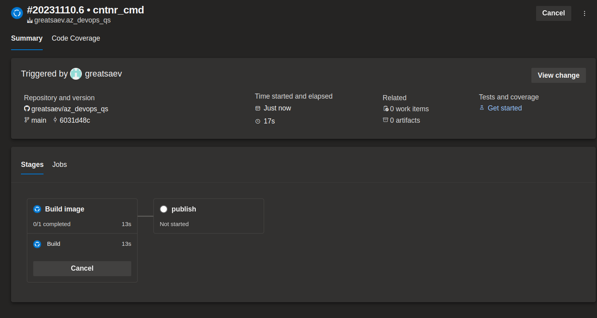
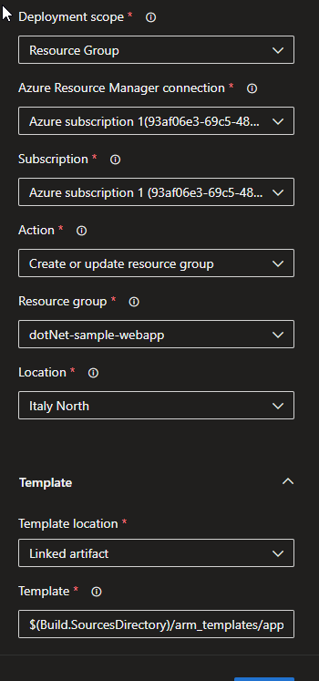

# Azure DevOps Quick Start Guide

Example **dotNET** web app in docker.

Pipeline builds docker image and publish it to **Azure App Services**

## Prerequisities

1. GitHub account

2. Azure account

3. Compute resources:

   1. Free parallelism granted via [Azure DevOps Parallelism Request Form](https://forms.office.com/pages/responsepage.aspx?id=v4j5cvGGr0GRqy180BHbR63mUWPlq7NEsFZhkyH8jChUMlM3QzdDMFZOMkVBWU5BWFM3SDI2QlRBSC4u)

   2. **Azure DevOps Agent** deployed on linux vm elsewhere ( [target environment](https://learn.microsoft.com/en-us/azure/devops/pipelines/process/environments?view=azure-devops#target-an-environment-from-a-deployment-job) )

## Steps

### 0. Create App service plan and Web App templates in Azure

[TOBEDONE]

### 1. Create new project in Azure DevOps

### 2. Create new pipeline

Select source code location

Select repo

Configure or review your pipeline and save it.

### 3. Configure triggers

#### Edit pipeline - - - >

#### Enable CI and save pipeline

#### if needed set condition, for e.g. defined tag:

so tagged with _trigger_tag1_ will trigger pipeline

### 4. Run pipeline

#### Push to repo in GitHub or manually trigger pipeline to run it.

#### 5. Check progress and logs

### 6. Check app

### 7. Deploy with ARM templates

#### Modify pipeline

Add ARM Template deployment task

Modify parameters

